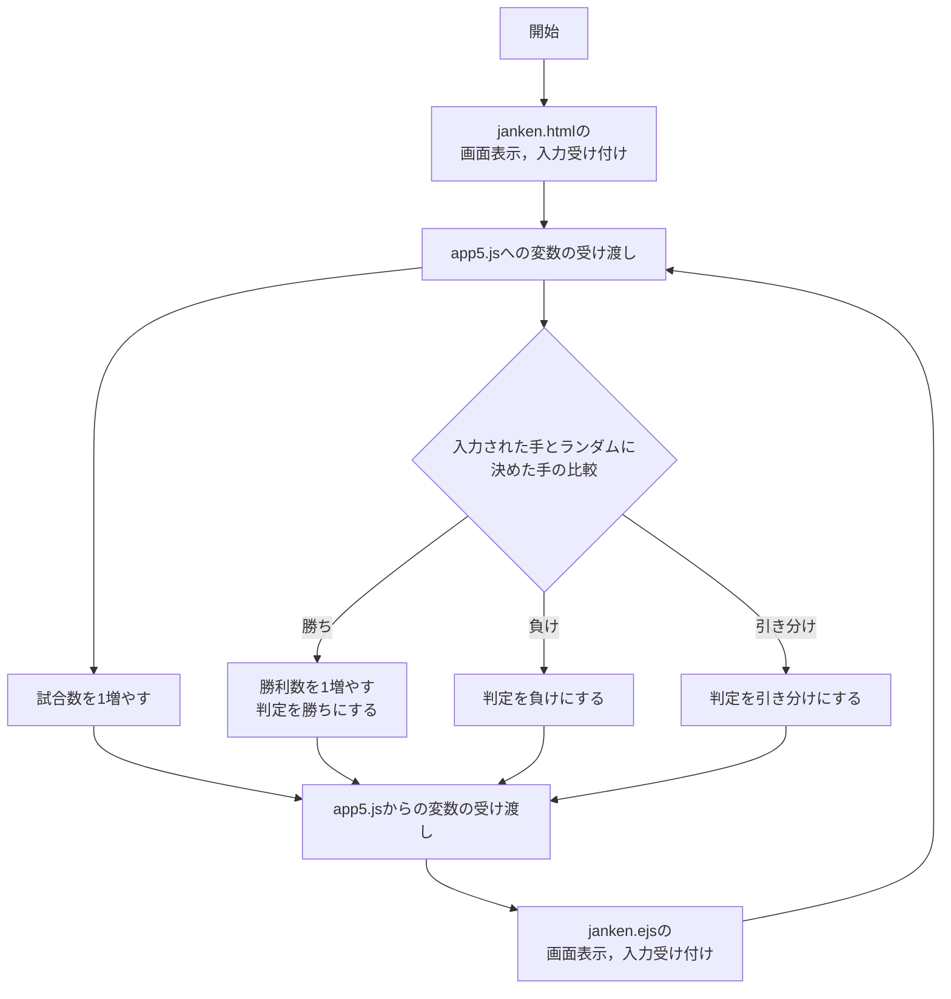
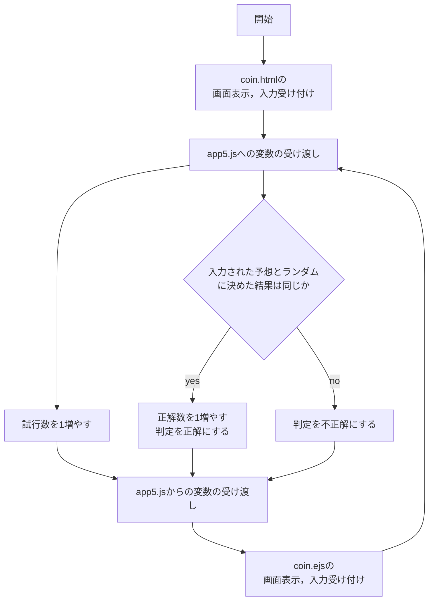
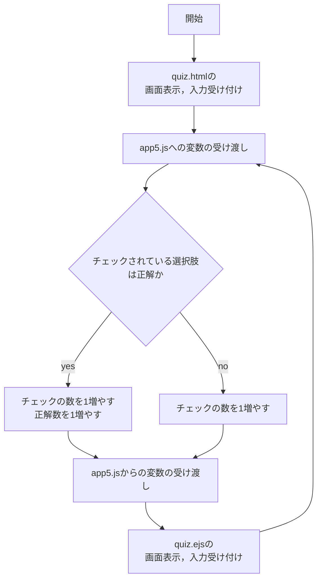

# webpro_06
## プログラムについて
フローチャートは本ドキュメントの下部に添付する．
### じゃんけん
このプログラムはじゃんけんのプログラムである．入力された手と，ランダムに決めたcpuの手を比較し勝敗を判定する．また入力された手，cpuの手，勝敗，それまでの試合数，勝利数を表示する．
### コイン投げ
このプログラムはコイン投げのプログラムである．コインが表か裏かを当てるゲームを行う．ラジオボタンで選択された予想とランダムに決められた結果を比較し正解かどうかを判定する．また予想，結果，判定，それまでの試行数，正解数を表示する．
### クイズ
このプログラムはクイズのプログラムである．チェックボックスを使い，野菜についての完答のクイズを一題出題する．チェックの総数と正解の選択肢のチェックの数を参照し，どちらも正解の選択肢の数と同じ場合は「パーフェクト！！」を，そうでない場合はチェックされた選択肢の数とそのうちいくつ正解であったかを表示する．またそれまでの回答数を表示する．

## 使用方法
1. ターミナルで適切なディレクトリに移動し，```git clone https://github.com/Saito-8128/webpro_06.git```を実行する．
1. ```cd webpro_06```でwebpro_06のディレクトリに移動してから```node app5.js```でapp5.js を起動する．
1. Webブラウザでlocalhost:8080/public/```<コマンド名>```.htmlにアクセスする．コマンド名はjanken,coin,quizの中から選ぶ．
1. 表示された画面の指示に従い，じゃんけんではグー，チョキ，パーから自分の手を入力，コイン投げでは表裏を選択，クイズでは緑黄色野菜だと思う選択肢を全て選択する．
1. 送信ボタンを押すと，画面が切り替わり勝敗や正誤が判定され，再び入力が受け付けられる．

## 使用するファイル一覧
ファイル名 | 説明
-|-
app5.js | プログラム本体
public/janken.html | じゃんけんの開始画面
views/janken.ejs | じゃんけんのjanken.html以降の画面
public/coin.html | コイン投げの開始画面
views/coin.ejs | コイン投げのcoin.html以降の画面
public/quiz.html | クイズの開始画面
views/quiz.ejs | クイズのquiz.html以降の画面

## ファイルの管理について
ファイルはgitによって管理している．gitとはファイルの過去の状態や編集履歴などを記録し，バージョン管理などを容易にするためのものである．
ファイルを編集した後は作業したディレクトリで以下の手順に従う．
1. ```git add .```を実行する．
1. ```git commit -am 'コメント'```を実行する．コメントは何をどう編集したかわかるように書く．
1. ```git push```を実行する．

このようにすることで作業を記録することができる．

## フローチャート
### じゃんけん


### コイン投げ


### クイズ
